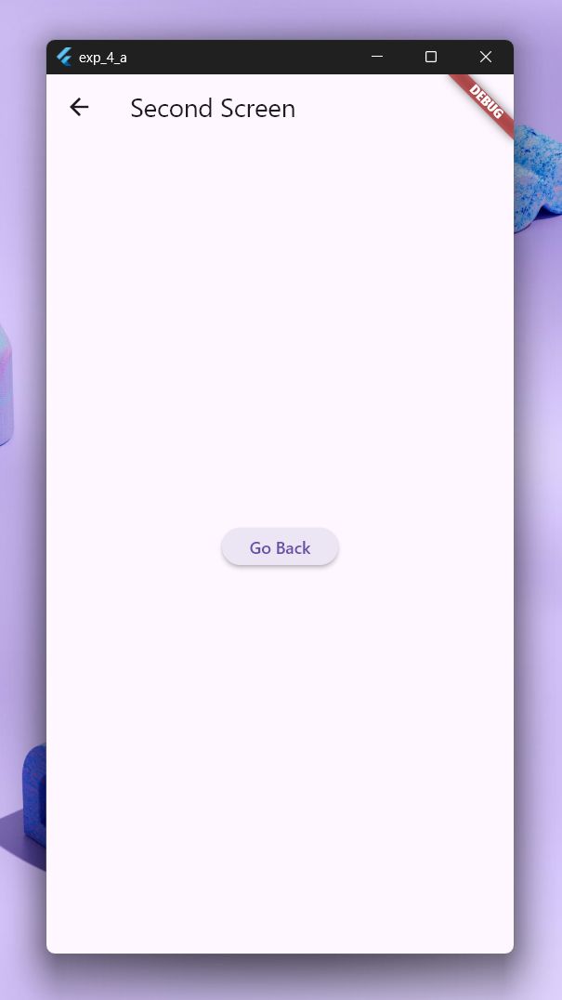

# Experiment 4 - Part B:  **Named Routes**

## Aim
Implement navigation with named routes in a Flutter app.

## Objective
To understand how to navigate between different screens in a Flutter app using named routes.
Understand deep linking in Flutter apps.

## Prerequisites
- Flutter SDK installed on your machine
- A code editor of your choice (e.g., Visual Studio Code)

## Procedure

1. Create a new Flutter project by running the following command in your terminal:
    ```cmd
    flutter create my_flutter_app
    ```
    The command creates a Flutter project directory called `my_flutter_app` that contains a simple demo app that uses [Material Components](https://m3.material.io/components).

2. Change to the Flutter project directory.
    ```cmd
    cd my_flutter_app
    ```
3. Open the `lib/main.dart` file in your Flutter project.

4. Replace the existing code with the following code snippet:
    ```dart
    import 'package:flutter/material.dart';

    void main() {
      runApp(const MainApp());
    }

    class MainApp extends StatelessWidget {
      const MainApp({super.key});

      @override
      Widget build(BuildContext context) {
        return MaterialApp(
          initialRoute: '/',
          routes: {
            '/': (context) => const HomeScreen(),
            '/second': (context) => const SecondScreen(),
          },
        );
      }
    }

    class HomeScreen extends StatelessWidget {
      const HomeScreen({super.key});

      @override
      Widget build(BuildContext context) {
        return Scaffold(
          appBar: AppBar(title: const Text('Home')),
          body: Center(
            child: ElevatedButton(
              onPressed: () {
                Navigator.pushNamed(context, '/second');
              },
              child: const Text('Go to Second Screen'),
            ),
          ),
        );
      }
    }

    class SecondScreen extends StatelessWidget {
      const SecondScreen({super.key});

      @override
      Widget build(BuildContext context) {
        return Scaffold(
          appBar: AppBar(title: const Text('Second Screen')),
          body: Center(
            child: ElevatedButton(
              onPressed: () {
                Navigator.pop(context);
              },
              child: const Text('Go Back'),
            ),
          ),
        );
      }
    }
    ```

5. Save the file.

6. Run your Flutter project using the following command:
    ```cmd
    flutter run
    ```
    Select the appropriate device to run the app.

7. During the app execution, you can use the following commands:
    - Enter `r` to hot reload the app and see the changes you made to the code.
    - Enter `q` to quit the app.


## Output


<video controls src="exp_4_b_output.mp4" title="exp_4_b_output"></video>

## Conclusion

In this lab, we learned how to navigate between different screens in a Flutter app using named routes.

We created two screens, `HomeScreen` and `SecondScreen`, and used the `Navigator` class to navigate between them. We defined the routes for the screens in the `MaterialApp` widget using the `routes` property. We used the `Navigator.pushNamed` method to navigate to the `SecondScreen` and the `Navigator.pop` method to go back to the previous screen.

By following this lab, you should now have a good understanding of how to implement navigation with named routes in a Flutter app.

## References
- [Navigation and routing](https://docs.flutter.dev/ui/navigation)
- [Deep linking in Flutter](https://docs.flutter.dev/ui/navigation/deep-linking)
- [Understanding navigation](https://m2.material.io/design/navigation/understanding-navigation.html) 
- [Learning Flutter's new navigation and routing system](https://medium.com/flutter/learning-flutters-new-navigation-and-routing-system-7c9068155ade)