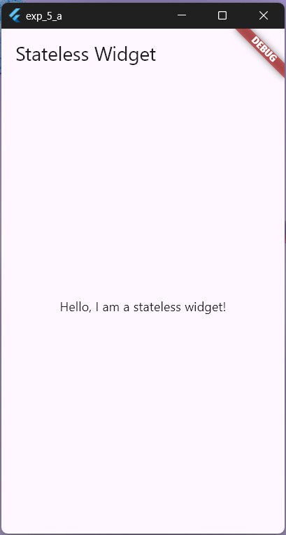
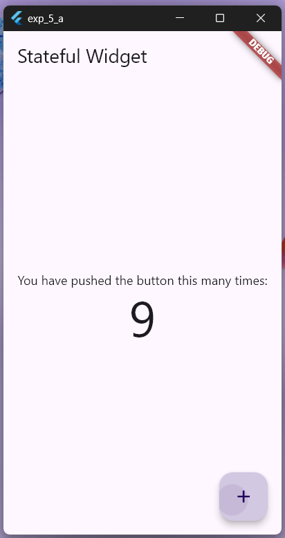

# STATEFUL and STATELESS widgets in Flutter

## Stateless Widgets

Stateless widgets are immutable, meaning their properties can't change once they're built. They are typically used for widgets that don't require any mutable state (i.e., they don't change over time or in response to user interactions). Examples of stateless widgets include `Text`, `Icon`, and `Container`.

### Key Points:
- Immutable
- Used for static content
- Lightweight and simple to use

### Structure:
1. Stateless widget class that extends `StatelessWidget`.
2. `build()` method that returns the widget's UI based on the input properties.

```dart
class MyWidget extends StatelessWidget {
  const MyWidget({super.key});

  @override
  Widget build(BuildContext context) {
    return /* ... Widget tree */;
  }
}
```

### Example:
```dart
import 'package:flutter/material.dart';

void main() => runApp(const MaterialApp(home: MyStatelessWidget()));

class MyStatelessWidget extends StatelessWidget {
  const MyStatelessWidget({super.key});

  @override
  Widget build(BuildContext context) {
    return Scaffold(
      appBar: AppBar(title: const Text('Stateless Widget')),
      body: const Center(
        child: Text('Hello, I am a stateless widget!'),
      ),
    );
  }
}
```
### Output:


## Stateful Widgets

Stateful widgets are dynamic and can change their state during their lifetime. They are used when the widget needs to update based on user interactions or other factors. Examples of stateful widgets include `Checkbox`, `Radio`, `Slider`, and `TextField`.

Stateful widgets consist of two classes:
1. A `StatefulWidget` class that is immutable and can be used to create an instance of the widget.
2. A `State` class that contains the mutable state for that widget.

### Key Points:
- Mutable state
- Used for dynamic content
- More complex than stateless widgets

### Structure:
1. StatefulWidget class that extends `StatefulWidget`.
2. State class that extends `State` and manages the widget's mutable state.
3. `createState()` method that creates an instance of the State class.
4. `build()` method in the State class that returns the widget's UI based on the current state.

```dart
class MyWidget extends StatefulWidget {
  const MyWidget({super.key});

  @override
  State<MyWidget> createState() => _MyWidgetState();
}

class _MyWidgetState extends State<MyWidget> {
  @override
  Widget build(BuildContext context) {
    return /* ... Widget tree and setState() if needed */;
  }
}
```

### Example:
```dart
import 'package:flutter/material.dart';

void main() => runApp(const MaterialApp(home: MyStatefulWidget()));

class MyStatefulWidget extends StatefulWidget {
  const MyStatefulWidget({super.key});

  @override
  State<MyStatefulWidget> createState() => _MyStatefulWidgetState();
}

class _MyStatefulWidgetState extends State<MyStatefulWidget> {
  int _counter = 0;

  void _incrementCounter() {
    setState(() {
      _counter++;
    });
  }

  @override
  Widget build(BuildContext context) {
    return Scaffold(
      appBar: AppBar(title: const Text('Stateful Widget')),
      body: Center(
        child: Column(
          mainAxisAlignment: MainAxisAlignment.center,
          children: <Widget>[
            const Text('You have pushed the button this many times:'),
            Text('$_counter', style: Theme.of(context).textTheme.displayLarge),
          ],
        ),
      ),
      floatingActionButton: FloatingActionButton(
        onPressed: _incrementCounter,
        tooltip: 'Increment',
        child: const Icon(Icons.add),
      ),
    );
  }
}
```
### Output:



##  Stateful vs Stateless Widgets:

| **Feature**              | **Stateful Widget**                              | **Stateless Widget**                              |
|--------------------------|--------------------------------------------------|--------------------------------------------------|
| **Mutability**           | Mutable                                          | Immutable                                        |
| **State Management**     | Manages its own state                            | Does not manage any state                        |
| **Lifecycle Methods**    | Complex lifecycle methods (`initState()`, `dispose()`, `setState()`) | Simple lifecycle (`build()`)                     |
| **Reactivity**           | Can react to changes and update UI dynamically   | Cannot react to changes, static UI               |
| **Performance**          | Slightly heavier due to state management         | Lighter, more efficient                          |
| **Use Cases**            | Dynamic content that changes over time           | Static content that does not change              |
| **Examples**             | Forms, animations, interactive elements          | Text, icons, containers                          |
| **Rebuild Frequency**    | Rebuilt when `setState()` is called              | Rebuilt only when parameters or parent changes   |
| **Initialization**       | Uses `createState()` to create state object      | Directly creates widget through `build()` method |
| **Complexity**           | More complex due to state handling               | Simpler and easier to use                        |


## Key Differences:
- State Management: Stateless widgets do not manage any state, while stateful widgets have an internal state that can change over time.
- Lifecycle: Stateful widgets have a more complex lifecycle with additional methods such as `initState()`, `setState()`, and `dispose()`, whereas stateless widgets only have the `build()` method.

## Use Cases:
- Stateless Widgets: Use these for UI elements that do not change, such as static text, icons, and layout containers.
- Stateful Widgets: Use these for UI elements that need to change dynamically based on user input or other factors, such as forms, sliders, and interactive elements.

For more detailed information, you can refer to the 
"Beginning Flutter A Hands-on Guide to App Development" by Marco L Napoli
, which provides in-depth examples and explanations.
<!-- ["Beginning Flutter A Hands-on Guide to App Development" by Marco L Napoli](https://digilib.stekom.ac.id/assets/dokumen/ebook/feb_3872ce7467cbdc7beedfcdc12b2b607b0ba36429_1649057575.pdf#page=36) -->