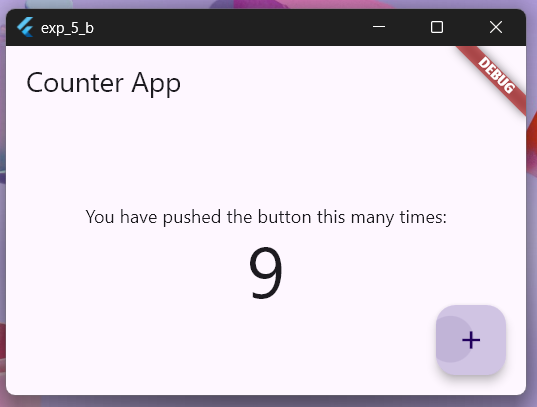

# Experiment 5 - Part B:  **`Setstate()` AND `Provider`**

## Aim
Implement state management using setState and Provider

## Objective
To understand how to manage the state of a Flutter app using the `setState` method and the `Provider` package.

## System Requirements
- **Flutter SDK**: version 2.0.0 or higher
- **IDE**: Visual Studio Code (Supported) or android studio (Supported) or IntelliJ IDEA (Supported).
- **Operating System**: Windows (7 or higher), macOS (10.12 or higher), or Linux (Ubuntu, Debian, Fedora, CentOS, or similar)

## Procedure

1. Create a new Flutter project by running the following command in your terminal:
    ```cmd
    flutter create my_flutter_app
    ```
    The command creates a Flutter project directory called `my_flutter_app` that contains a simple demo app that uses [Material Components](https://m3.material.io/components).

2. Change to the Flutter project directory.
    ```cmd
    cd my_flutter_app
    ```
3. Create a new Dart file called `counter_model.dart` in the `lib` directory of your Flutter project.
    ```cmd
    touch lib/counter_model.dart
    ```

4. Open the `pubspec.yaml` file in your Flutter project and add the following lines after `flutter:` to include the image asset in your project:

    ```yaml
    dependencies:
    flutter:
        sdk: flutter
    provider: ^6.0.0 <-- Add this line
    ```
    Save the file.

5. Add the following code snippet to the `counter_model.dart` file:
    ```dart
    import 'package:flutter/foundation.dart';

    // CounterModel class that extends ChangeNotifier
    class CounterModel extends ChangeNotifier {
      int _counter = 0;

      // Getter for the counter value
      int get counter => _counter;

      // Method to increment the counter and notify listeners
      void increment() {
        _counter++;
        notifyListeners();
      }
    }
    ```
    Save the file.

6. Open the `lib/main.dart` file in your Flutter project.

7. Replace the existing code with the following code snippet:
    ```dart
    // Import necessary packages
    import 'package:flutter/material.dart';
    import 'package:provider/provider.dart';
    import 'counter_model.dart';

    // Main function
    void main() {
      runApp(
        // Wrap the app with ChangeNotifierProvider to provide the CounterModel
        ChangeNotifierProvider(
          create: (context) => CounterModel(),
          child: const MyApp(),
        ),
      );
    }

    // MyApp widget
    class MyApp extends StatelessWidget {
      const MyApp({super.key});

      @override
      Widget build(BuildContext context) {
        return const MaterialApp(
          home: CounterPage(),
        );
      }
    }

    // CounterPage widget
    class CounterPage extends StatelessWidget {
      const CounterPage({super.key});

      @override
      Widget build(BuildContext context) {
        return Scaffold(
          appBar: AppBar(
            title: const Text('Counter App'),
          ),
          body: Center(
            child: Consumer<CounterModel>(
              builder: (context, counterModel, child) {
                return Column(
                  mainAxisAlignment: MainAxisAlignment.center,
                  children: [
                    const Text('You have pushed the button this many times:'),
                    Text(
                      '${counterModel.counter}',
                      style: Theme.of(context).textTheme.displayLarge,
                    ),
                  ],
                );
              },
            ),
          ),
          floatingActionButton: FloatingActionButton(
            onPressed: () {
              // Call the increment method of CounterModel using Provider
              Provider.of<CounterModel>(context, listen: false).increment();
            },
            tooltip: 'Increment',
            child: const Icon(Icons.add),
          ),
        );
      }
    }
    ```

8. Save the file.

9. Run your Flutter project using the following command:
    ```cmd
    flutter run
    ```
    Select the appropriate device to run the app.

10. During the app execution, you can use the following commands:
    - Enter `r` to hot reload the app and see the changes you made to the code.
    - Enter `q` to quit the app.


## Output


https://github.com/user-attachments/assets/22038ae9-97eb-4040-a85b-50fcf2ecb187


## Conclusion

In this experiment, we learned how to implement state management in a Flutter app using the `setState` method and the `Provider` package. We created a simple counter app that allows the user to increment the counter value by tapping a button. By using the `ChangeNotifierProvider` and `Consumer` widgets from the `Provider` package, we were able to update the UI whenever the counter value changed. This approach provides a scalable and efficient way to manage the state of a Flutter app.

## References
- Flutter Documentation: [Simple app state management](https://docs.flutter.dev/data-and-backend/state-mgmt/simple)
- Provider Package: [provider: 6.1.2](https://pub.dev/packages/provider)
- Flutter UI: [FloatingActionButton](https://api.flutter.dev/flutter/material/FloatingActionButton-class.html)
- Material Components: [FAB](https://m3.material.io/components/floating-action-button/overview)
